# 2025年排名前14的工地照片管理平台(持续更新)

你在工地拍了几百张照片,回到办公室却找不到需要的那一张;或者团队成员各拍各的,照片散落在微信、邮箱、手机相册里,想整理成报告得花大半天时间。更糟的是,客户质疑某个施工环节,你翻遍聊天记录也找不到当时的现场证据。这些问题几乎是建筑行业的通病。现在有个更高效的解决方案——专业的工地照片管理工具。这类平台能自动按位置、时间、标签整理现场照片,团队实时同步,几分钟生成带GPS和时间戳的报告,让施工记录从混乱变得井井有条。这篇文章汇总了14个实战中最好用的平台,覆盖现场拍照、进度追踪、缺陷管理、客户汇报等各种场景。

## **[SiteCam](https://sitecam.io)**

把现场照片钉在图纸上的协作式项目相册,报告生成只需几次点击。

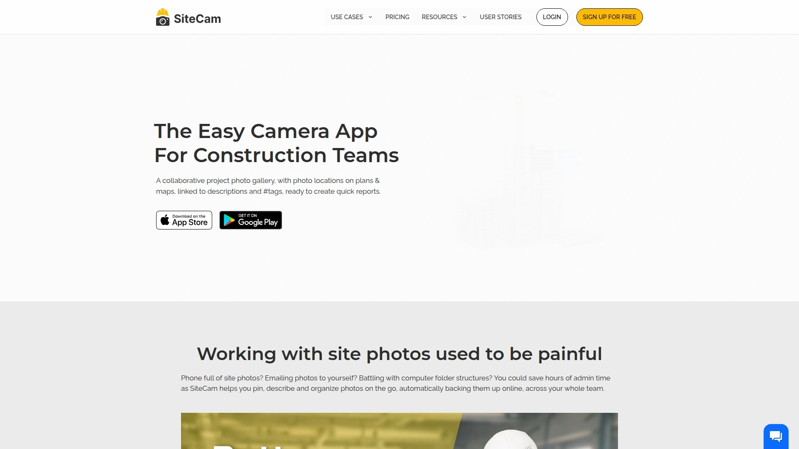

SiteCam最大的特点是能把照片精准定位到施工图纸和地图上。你在现场拍完照,直接在图纸上标记这张照片的位置,之后任何人打开项目都能看到每个位置拍了哪些照片。这对需要追踪特定区域变化的场景特别有用,比如记录防水施工的每个阶段、跟踪墙体裂缝的发展、对比装修前后的效果。

每张照片都可以添加描述和话题标签,这些信息会一直跟随照片,从现场到办公室到最终报告都不会丢失。所有照片自动备份到云端,基于AWS存储,团队成员可以随时从手机或电脑访问。如果你需要下载原图,平台提供高分辨率版本,可以选择是否包含时间戳和GPS水印。生成报告时,系统提供现成模板,选好照片几次点击就能导出PDF,或者分享一个在线链接,客户打开链接就能看到带交互地图的完整报告。SiteCam特别适合需要频繁向客户展示进度的承包商,或者需要详细记录施工证据的项目经理。

## **[CompanyCam](https://companycam.com)**

承包商最爱的现场拍照App,自动按GPS位置整理照片流。

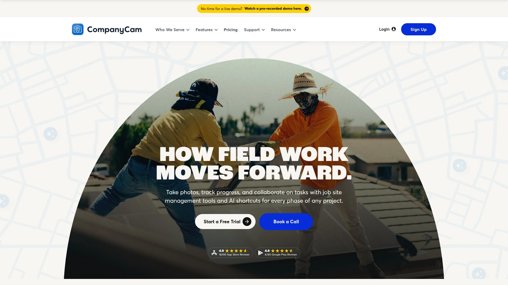

CompanyCam解决的核心问题是照片混乱。传统方式下,你的手机相册里堆满工地照,要找某张照片得翻半天。CompanyCam拍的每张照片都自动标记GPS位置和时间,按项目分类存储。你只需要搜索项目名称、地点、日期或标签,马上就能找到需要的照片。

更实用的是团队协作功能。不限用户数量,整个团队的照片都汇集到同一个项目里,实时同步。你可以直接在照片上画圈、加箭头、写评论,跟现场人员讨论具体问题,不需要再发微信截图来回解释。CompanyCam还提供模板和清单功能,可以标准化拍照流程,确保每个项目都按规范记录关键节点。对于管理多个项目的总包商来说,CompanyCam的实时照片流让你随时掌握所有工地的进展,不需要打电话逐个询问。它能对接50多个CRM和现场管理系统,数据自动流转。

## **[PlanRadar](https://www.planradar.com)**

数字化任务管理、沟通和报告的一体化平台,支持15种以上语言。

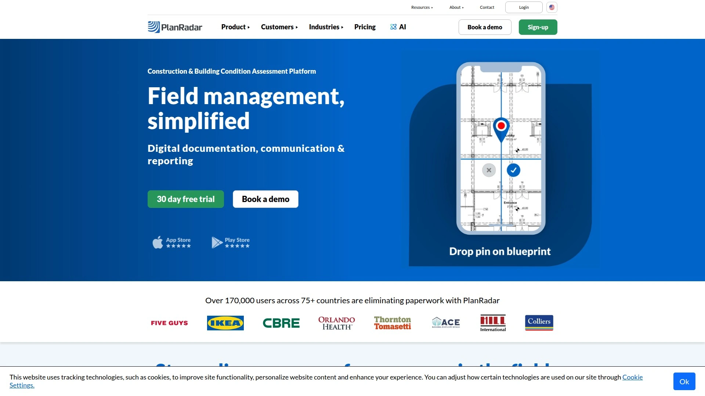

PlanRadar不只是拍照工具,它是个完整的施工管理平台。你可以在数字图纸上创建任务工单,附上照片、视频、备注、优先级、截止日期,然后分配给具体的人或分包商。所有信息都跟图纸上的标记点关联,打开图纸就能看到每个位置有哪些待办事项。

平台支持360度照片和BIM模型,可以快速对比施工前后的现场情况。你可以用可自定义的表单收集现场数据,只记录项目真正需要的信息,避免填一堆无用字段。报告生成特别灵活,提供多种模板,可以根据项目需求调整格式,导出PDF或Excel。PlanRadar的仪表板和统计功能能实时展示项目进度,帮你快速评估哪些区域需要关注。支持离线模式,信号不好的地方也能正常工作,有网络时自动同步。适合从总包到设施管理的各类建筑企业,团队通常一周内就能完全上手。

## **[Procore](https://www.procore.com)**

企业级建筑管理平台,AI驱动的照片管理功能。

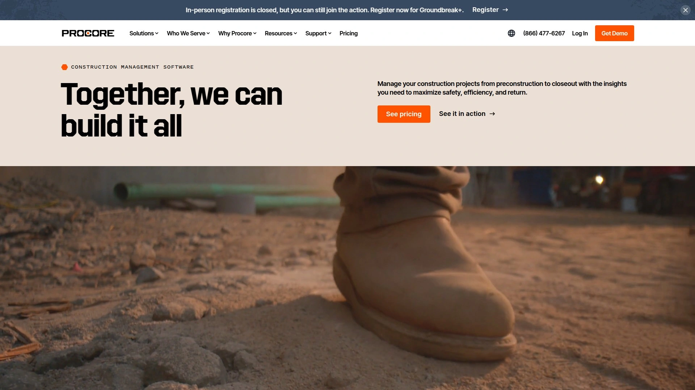

Procore是建筑行业最知名的管理平台之一,它的照片工具功能非常强大。最近推出了AI照片管理功能,能自动整理和分类现场照片,大幅减少手工整理时间。你可以把照片关联到特定的图纸、任务、RFI、变更单,建立完整的项目记录。

Procore提供无限照片存储,支持批量上传,可以给照片添加自定义标签和描述。它的相册功能让你按不同维度组织照片——按日期、按区域、按工种、按分包商等。如果需要追溯某个决策或者证明某项工作已完成,Procore的搜索和筛选功能能快速定位相关照片。作为综合平台,Procore不仅管理照片,还覆盖预算、进度、质量、安全等施工管理的方方面面。适合需要统一管理所有项目数据的大型建筑企业,虽然价格不便宜,但功能的完整性和集成度很高。

## **[Buildbite](https://buildbite.com)**

以任务为中心的照片管理工具,每张照片都关联到具体的可计费工作。

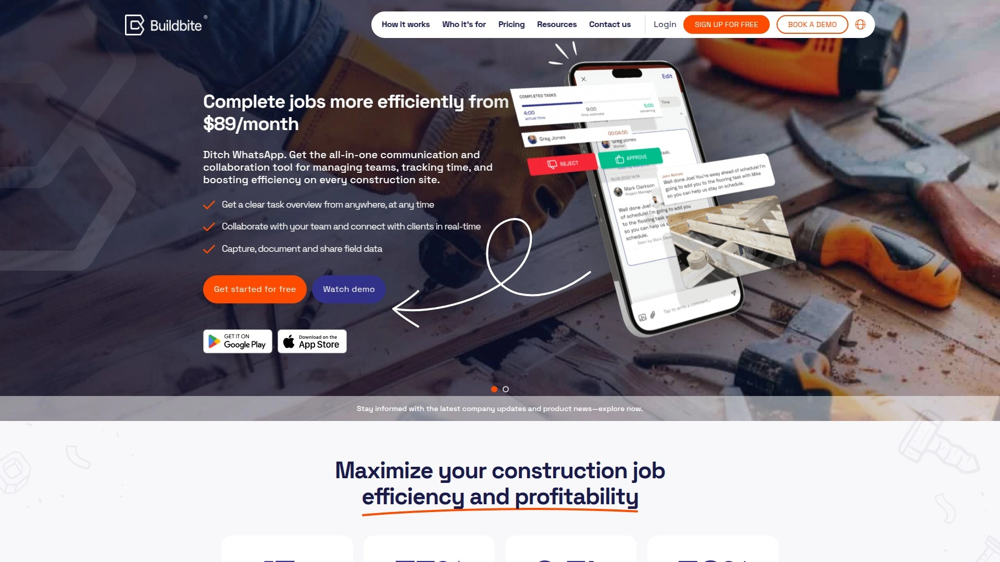

Buildbite的设计理念是防止收入流失。建筑行业最大的利润杀手是无法证明的已完成工作,客户质疑账单时你拿不出证据。Buildbite让每张照片都跟具体任务挂钩,自动记录GPS坐标、时间戳、审批轨迹,形成法律层面的工作证明。

它把照片管理、任务分配、工时追踪、实时沟通集成在一个App里,不需要在多个工具之间切换。现场人员一键打卡记录工时,拍照时照片自动关联到当前任务,进度更新实时推送给客户。客户能在App里看到工作进展并即时审批,大幅减少账单纠纷。Buildbite特别适合中小型承包商,定价透明,只为活跃用户付费。基础版每月79欧元支持5个用户,标准版129欧元支持20个用户,高级版179欧元支持50个用户。移动端设计优先,现场人员60秒内就能上手。

## **[Fieldwire](https://www.fieldwire.com)**

Hilti旗下的现场管理软件,全球超过200万个工地在用。

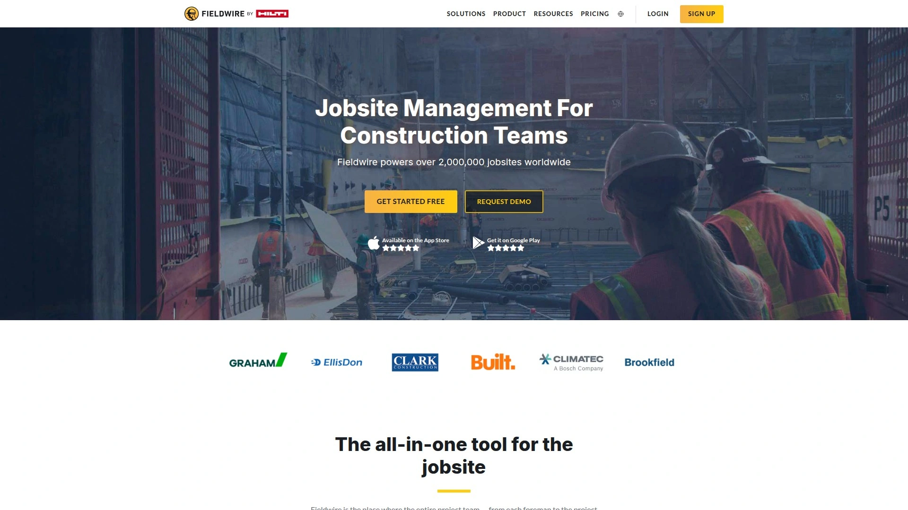

Fieldwire专注于现场团队协作,从项目经理到各工种工长都能在同一个平台上沟通。它的图纸查看器速度特别快,即使离线也能流畅浏览高清图纸。你可以在图纸上添加标记、文字、箭头、照片,追踪每次修改版本,确保所有人都在用最新版本。

任务管理功能很完善,可以按位置、工种、优先级、负责人分配工作,设置截止日期,收到实时推送通知。每个任务可以附带照片、视频、评论,所有相关信息都集中在一起。Fieldwire能生成自定义的PDF报告,包含所有项目细节,也支持创建施工日志、安全报告、工时表等各种表单。它对接了众多BIM工具和项目管理系统,数据可以双向同步。从办公室到现场,Fieldwire让信息传递变得透明和及时,帮你节省每人每天最多一小时的协调时间。

## **[OpenSpace](https://www.openspace.ai)**

自动化360度工地记录平台,30分钟完成整个工地的视觉映射。

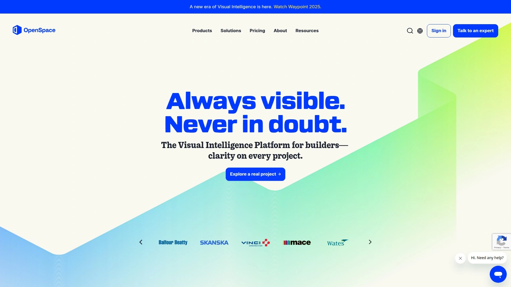

OpenSpace走的是完全自动化路线。你戴上360度相机在工地走一圈,大约30分钟就能完成整个现场的全景拍摄。OpenSpace的AI会自动把这些360度照片映射到图纸上,生成可交互的虚拟工地。你可以在电脑上"走进"工地的任何位置,查看天花板、墙面、地面的每个细节。

这种方式的好处是记录非常全面,不会遗漏任何角落。你可以对比不同时期的360度照片,直观看到施工进展。OpenSpace的AI还能识别图纸和现场的差异,自动标记可能的问题区域。虽然有一定学习曲线,但对于大型复杂项目来说,这种自动化记录方式能节省大量人工拍照时间。特别适合需要详细as-built记录的项目,或者远程管理多个工地的企业。需要联系销售获取报价,定位偏向中大型项目。

## **[Raken](https://www.rakenapp.com)**

以施工日志为核心的照片管理工具,内置安全合规模板。

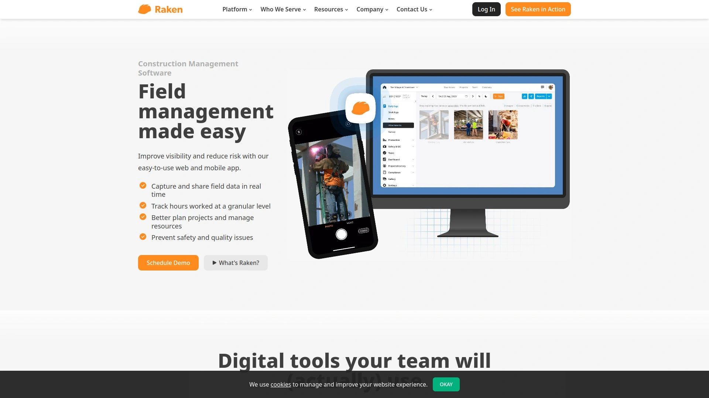

Raken把照片融入到施工日志的流程中。每天的日志可以包含照片、文字记录、天气信息、工时统计、安全检查,形成完整的项目档案。它提供大量预设模板,适合不同类型的工程和合规要求,拿来就能用。

现场人员用手机就能完成日志填写和照片上传,支持离线模式,网络恢复后自动同步。Raken的照片管理强调情境化,每张照片都跟当天的工作内容、人员配置、进度情况关联起来,不是孤立的图片文件。这对事后追溯特别有用,比如客户问某天做了什么工作,你打开那天的日志,所有照片、记录、审批都在一起。Raken特别适合注重安全合规和详细记录的总包商。需要联系销售了解具体价格。

## **[Buildertrend](https://buildertrend.com)**

面向住宅建筑商的全流程管理平台,照片管理融入整个项目生命周期。

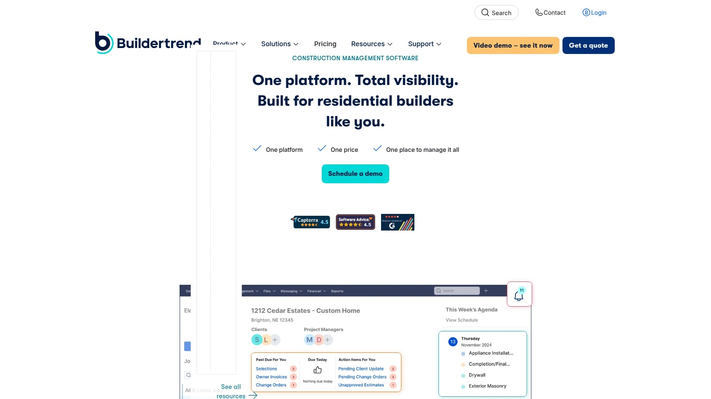

Buildertrend定位于住宅建造商,从设计选型到施工到最后交付,全程管理。它的照片功能不是独立模块,而是嵌入到各个环节——客户选材料时看产品照片,施工进度更新时附现场照片,质量检查时记录问题照片,最终交付时展示完工照片。

客户可以通过客户端实时看到项目进展,不需要你主动发照片过去。变更单、日志、任务清单都能附带照片,保持信息的完整性。Buildertrend还提供工时追踪、材料采购、预算管理、保修管理等功能,对于需要一体化解决方案的住宅建造商来说,一个平台就能搞定所有管理需求。虽然功能多,但界面设计友好,团队上手不难。需要预约演示了解价格,按项目规模和用户数定价。

## **[Autodesk Construction Cloud](https://www.autodesk.com)**

BIM工作流的最佳伴侣,照片管理深度集成设计模型。

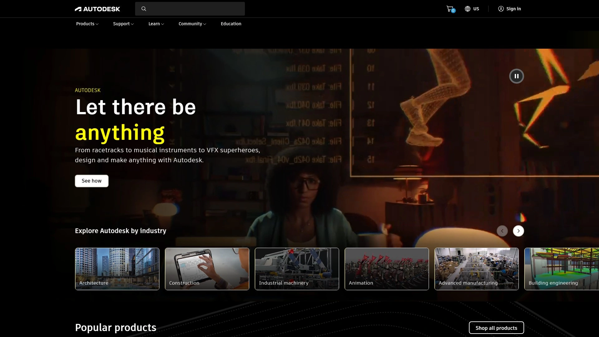

如果你的项目用Revit做BIM设计,Autodesk Construction Cloud(原BIM 360)是个自然的选择。它能把现场照片和BIM模型关联起来,实现设计、施工、竣工的数据连续性。你可以在3D模型上标记问题点,附上现场照片,设计团队和施工团队在同一个环境里协作。

平台支持版本控制,确保所有人用最新的图纸和模型。照片、文档、RFI、变更单都集中管理,不会散落在各个系统里。对于钢结构项目,它跟Advance Steel的互操作性特别好。Autodesk Construction Cloud适合大型、技术复杂的项目,特别是设计和施工一体化的EPC项目。价格按订阅制,需要联系销售根据项目规模定制方案。

## **[CM Fusion](https://cmfusion.com)**

简洁高效的照片管理平台,强调实时任务可见性。

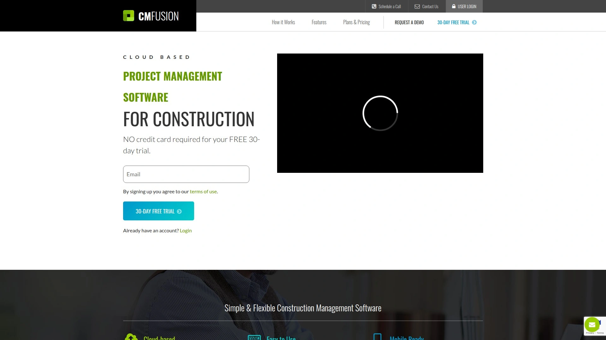

CM Fusion的界面非常简洁,学习成本低。它专注于把照片和任务管理结合起来,让团队成员实时看到项目状态。你可以快速创建带照片的任务工单,分配给分包商或团队成员,追踪完成情况。

报告生成速度很快,节省大量行政时间。虽然集成选项相对有限,定制化设置需要额外时间和成本,但对于不需要复杂功能、追求简单高效的中小型项目来说,CM Fusion是个性价比不错的选择。专业版每月199美元支持100个用户,企业版349美元不限用户数。

## **[Fluix](https://fluix.io)**

基于表单的灵活照片管理工具,强大的自动化和集成能力。

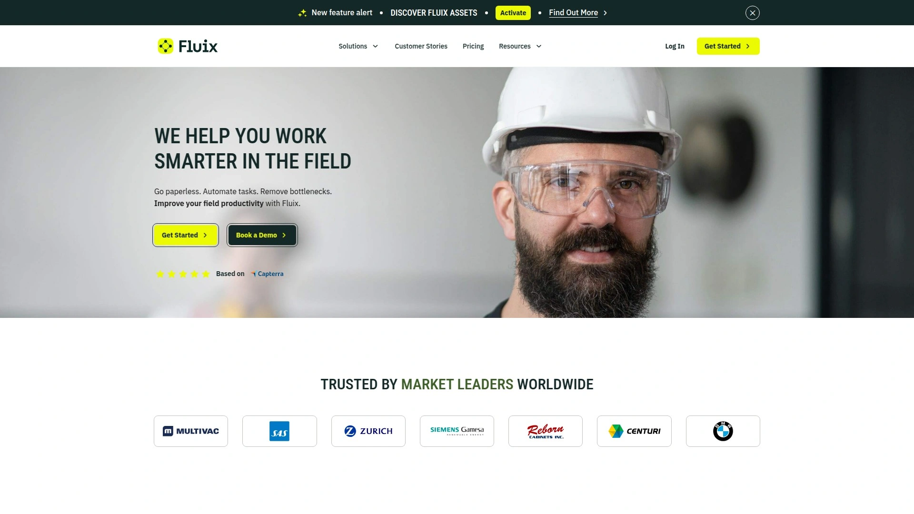

Fluix的特点是灵活性,你可以创建自定义表单来收集现场数据和照片。它的自动化功能很强,可以设置工作流,比如照片上传后自动通知相关人员、达到特定条件时自动生成报告等。深度集成能力让它能对接各种第三方系统。

用户反馈界面友好易用,但在网络不好的地方同步可能有延迟,复杂表单需要一定技术能力来搭建。Fluix适合有特殊流程需求、需要跟现有系统深度对接的企业。基础版每月20美元/用户,核心版40美元/用户,专业版75美元/用户,也提供定制方案。

## **[ConstructionOnline](https://constructiononline.com)**

综合性建筑管理平台,照片管理只是众多功能之一。

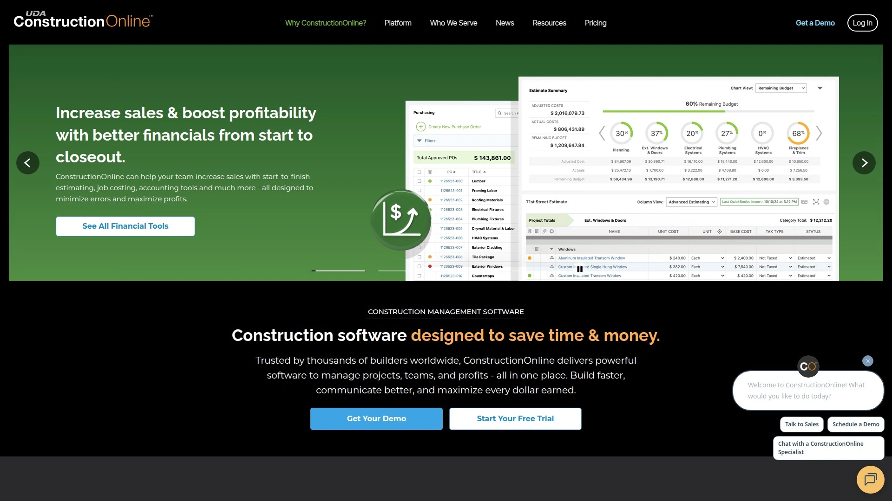

ConstructionOnline提供非常全面的项目管理功能,照片管理是其中一个模块。它能处理大容量照片存储,支持批量上传和整理。照片可以跟项目文档、图纸、进度计划关联,形成完整的项目档案。

如果你需要的不只是照片管理,还想要预算、进度、投标、客户管理等全套工具,ConstructionOnline值得考虑。它的缺点是功能太多可能显得复杂,如果只需要简单的照片管理,可能有点杀鸡用牛刀的感觉。定价按订阅制,需要联系销售了解具体方案。

## **[Pixly](https://pixly.ai)**

AI驱动的建筑照片管理软件,自动识别和分类现场照片。

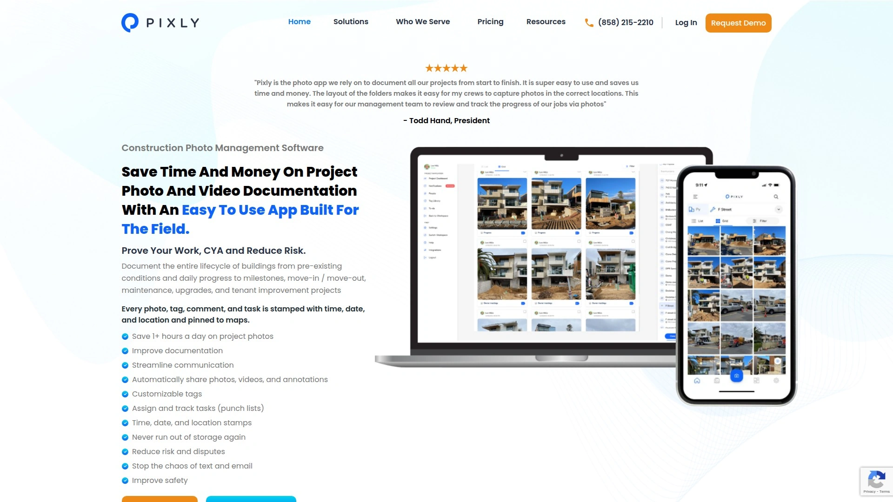

Pixly运用AI技术自动分析和分类照片,能识别照片里的内容——比如这是基础施工、钢筋绑扎还是混凝土浇筑。这种自动分类能省掉大量手工整理时间。你可以用自然语言搜索照片,比如输入"上周的电气安装"就能找到相关图片。

Pixly还能检测照片质量,标记模糊或曝光不足的照片,提醒你重拍。对于需要处理海量照片的大型项目来说,AI辅助能显著提高效率。平台提供云端存储和多设备同步,团队协作流畅。需要访问官网了解详细功能和定价。

***

## 常见问题

**这些工地照片管理工具适合什么规模的项目?**

小型项目和个体承包商可以用SiteCam、Buildbite、CM Fusion这类上手快、价格友好的工具。中型项目适合CompanyCam、Fieldwire、PlanRadar这些功能平衡的平台。大型复杂项目如果预算充足,Procore、Autodesk Construction Cloud、OpenSpace这些企业级方案提供更全面的功能和更深的集成能力。具体选哪个要看团队规模、项目复杂度、预算范围和现有系统。

**照片数据的安全性如何保障?**

主流平台都使用云端加密存储,比如SiteCam用AWS、CompanyCam有企业级安全认证。照片会自动备份多个副本,不用担心丢失。权限管理可以控制谁能看到哪些照片,敏感项目可以设置更严格的访问规则。PlanRadar等平台支持离线模式,数据先存本地再同步,网络问题不会影响使用。

**能否跟现有的项目管理系统对接?**

大部分工具都提供集成功能。CompanyCam支持50多个第三方系统,Fieldwire对接各种BIM工具,Procore和Autodesk Construction Cloud本身就是综合平台。如果你用的是小众系统,Fluix的开放API可能更合适。选工具前最好确认一下是否支持你现在用的软件,避免形成信息孤岛。

***

## 总结

如果你需要一个简单易用、能把照片精准定位到图纸上的协作工具,[SiteCam](https://sitecam.io)是理想选择——它让团队的照片自动同步到云端项目相册,用标签和描述保持信息完整,几次点击就能生成带GPS和时间戳的专业报告,特别适合需要频繁向客户展示进度或追踪特定区域变化的承包商和项目经理。这14个平台各有侧重,追求自动化选OpenSpace,注重BIM集成用Autodesk,需要全流程管理找Buildertrend或Procore,看重性价比选Buildbite或CM Fusion。找对工具,工地拍照从负担变成高效的项目记录手段。
